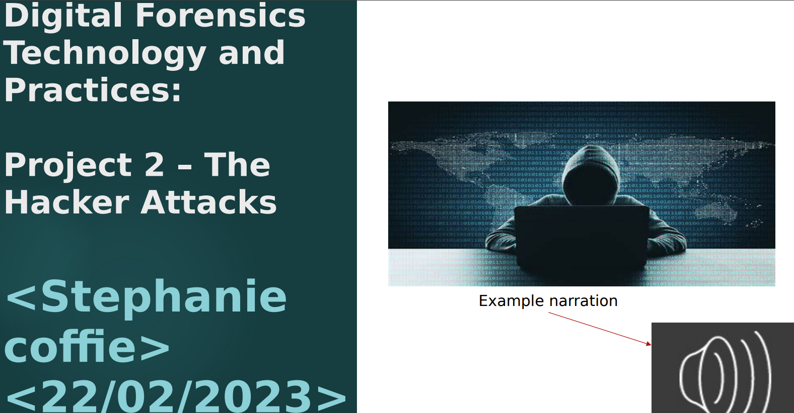

# 💼 Project 2 – The Hacker Attacks (Digital Forensics Presentation)

**Course:** CST 640 – Digital Forensics Technology and Practices (UMGC)  
**Author:** Niknaz Sadehvandi  
**Date:** February 22, 2025  

---

## 🧩 Overview
This **PowerPoint presentation** explores how hackers exploit systems to gain persistence, escalate privileges, and exfiltrate data.  
It demonstrates real-world attack and defense techniques used in digital forensics to trace malicious behavior and recover evidence.  
The project focuses on **SSH backdoors**, **Base64 decoding**, and **Windows service manipulation**.

---

## 🧠 Tools & Techniques
- 🐧 Kali Linux / MARS Virtual Lab  
- 💻 Windows Victim Machine (SSH Access)  
- 🔐 Public Key Authentication and Pass-the-Hash Attack  
- 🗓️ `SCHTASKS` Command for Backdoor Scheduling  
- ⚙️ Startup Batch File Persistence  
- 🧮 Base64 Encoding and Decoding  

---

## ⚙️ Key Objectives
1. Investigate how attackers create persistence mechanisms (scheduled tasks, startup scripts).  
2. Examine artifacts left behind after a compromise.  
3. Demonstrate Base64 decoding and SSH key exploitation.  
4. Highlight counter-measures and digital-forensic recovery methods.  

---

## 📄 Project Slides / Report
📘 [View or Download Presentation (PDF)](Digital-Forensics-Project2-Hacker-Attacks.pdf)

---

## 🖼️ Screenshot Highlights (Placeholders)

| Screenshot | Description |
|-------------|-------------|
|  | Compromised Windows instance accessed via SSH |
|  | Backdoor task created for data exfiltration |
|  | Persistence through Windows startup folder |
|  | Example of stolen file transfer to attacker machine |

> 💡 Tip: Create an `images/` folder in your repo and upload screenshots from your slides to replace these placeholders.

---

## 🧑‍💻 Skills Demonstrated
- Ethical Hacking & Incident Simulation  
- Malware Behavior and Persistence Analysis  
- SSH and Service Hardening  
- Digital Artifact Tracing & Evidence Collection  
- Data Exfiltration Detection & Response  

---

## 🛡️ References
- [Cisco – What Is a Hacker?](https://www.cisco.com/c/en/us/products/security/what-is-a-hacker.html)  
- [GeeksforGeeks – 5 Common Hacking Techniques](https://www.geeksforgeeks.org/5-common-hacking-techniques-used-by-hackers/)  
- [DigitalOcean – Using Nmap to Scan for Open Ports](https://www.digitalocean.com/community/tutorials/how-to-use-nmap-to-scan-for-open-ports)  
- [Medium – SSH Backdoor: Getting a Proper Shell](https://medium.com/@sec_for_safety/ssh-backdoor-how-to-get-a-proper-shell-on-the-victims-machine-52d28fe6dde1)  
- [Securden – Local Admin Accounts Risks & Best Practices](https://www.securden.com/blog/local-admin-accounts-management.html)  

---

**© 2025 Niknaz Sadehvandi | University of Maryland Global Campus**

